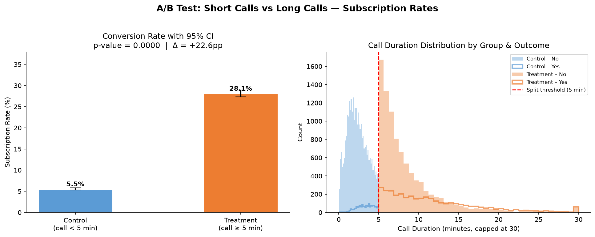
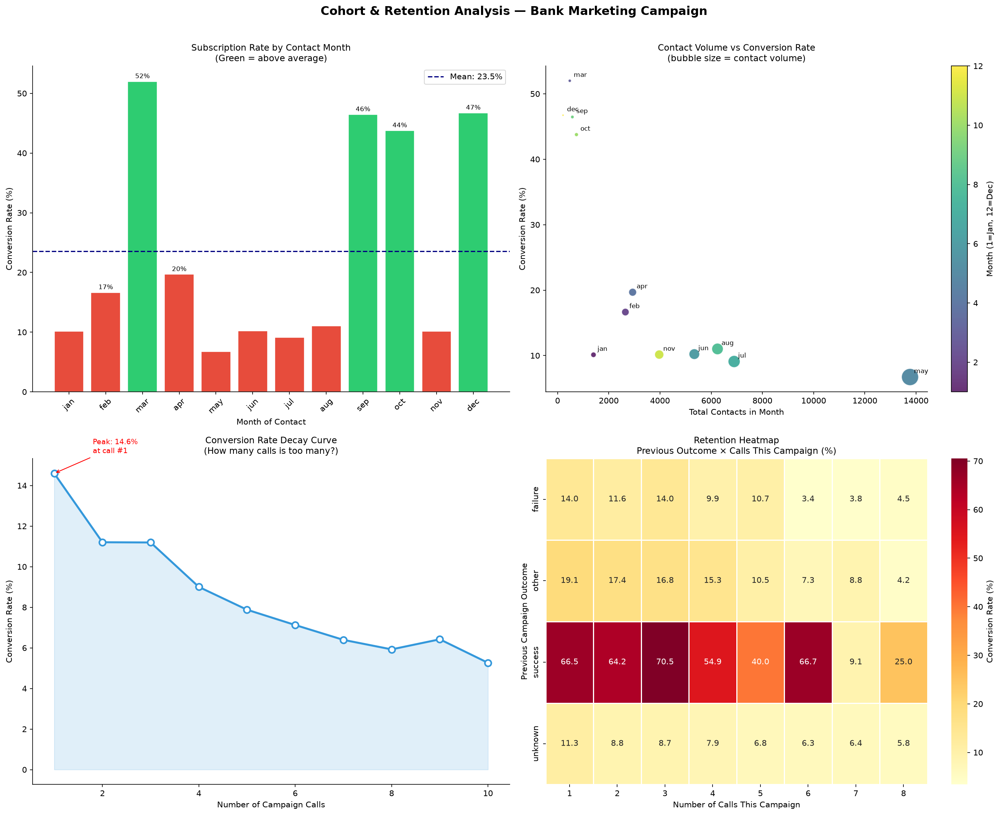
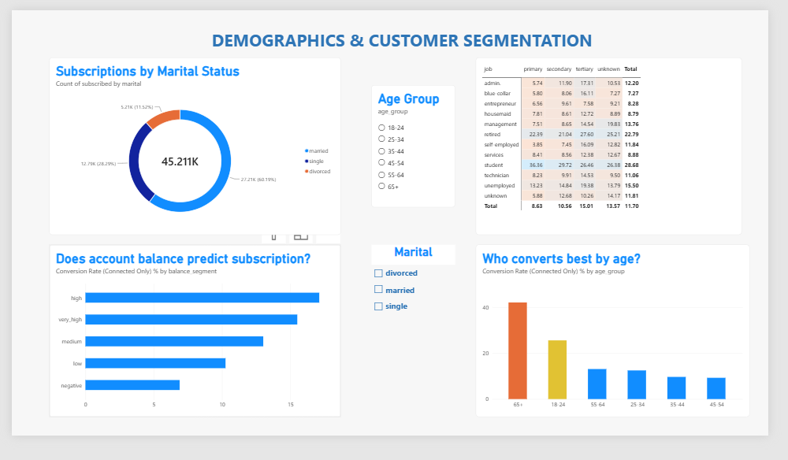
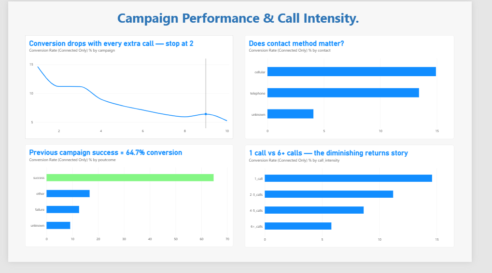
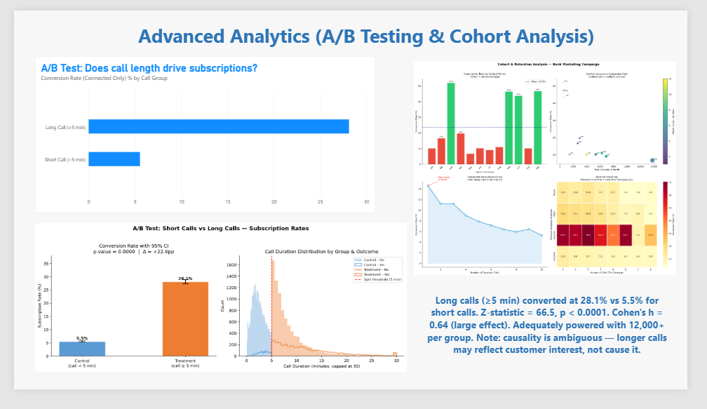
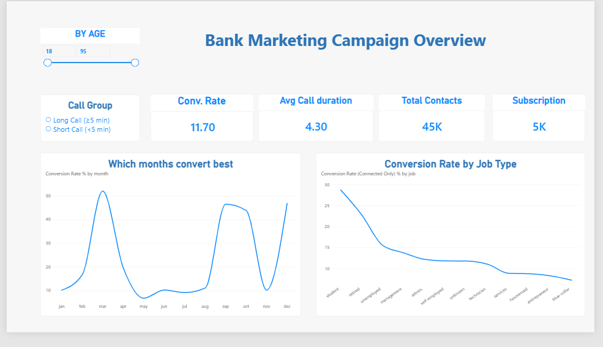

# Bank Marketing Campaign Analysis

End-to-end data analyst portfolio project on real Portuguese bank telemarketing data (2008–2013).  
Covers the full analyst workflow: data pull → cleaning → SQL analysis → A/B testing → cohort retention → Power BI dashboard.

---

## Business Question

> **Which customer segments are most likely to subscribe to a term deposit, and how should the bank optimise its calling campaigns?**

---

## Dataset

- **Source:** [UCI ML Repository — Bank Marketing](https://archive.ics.uci.edu/dataset/222/bank+marketing)
- **Size:** 45,211 rows × 17 columns (real data, not pre-cleaned)
- **Period:** 2008–2013, Portuguese retail bank
- **Target:** Did the customer subscribe to a term deposit? (yes/no)

No Kaggle account required — data is pulled automatically via script.

---

## Project Structure

```
bank-marketing-analysis/
├── 01_data_pull.py           # Pull data from UCI API, unzip, inspect
├── 02_cleaning.py            # Clean, engineer features, document decisions
├── 03_sql_analysis.py        # Load to SQLite, run 8 business SQL queries
├── 04_ab_test.py             # A/B test with proper statistics
├── 05_cohort_retention.py    # Cohort & retention analysis
├── run_all.py                # Run entire pipeline in one command
├── requirements.txt          # Python dependencies
├── sql/
│   └── analysis_queries.sql  # Standalone SQL queries (window functions, CTEs)
├── outputs/
│   ├── *.csv                 # Query results (7 files)
│   └── charts/
│       ├── ab_test_results.png
│       └── cohort_retention.png
└── data/
    ├── bank.db               # SQLite database (connect Power BI here)
    ├── raw/                  # Original pulled data
    └── cleaned/              # Cleaned dataset (28 columns)
```

---

## How to Run

```bash
# Install dependencies
pip install -r requirements.txt

# Run full pipeline
python run_all.py

# Or run individual steps
python 01_data_pull.py
python 02_cleaning.py
python 03_sql_analysis.py
python 04_ab_test.py
python 05_cohort_retention.py
```

---

## Key Findings

### Who converts best?
| Segment | Conversion Rate |
|---|---|
| Retired + tertiary education | 27.6% |
| Students (secondary) | 29.7% |
| Age 65+ | 42.1% |
| Age 35–54 (prime working age) | ~9–10% |
| Overall average | 11.7% |

### When to call?
| Month | Conversion Rate |
|---|---|
| March | **52.0%** |
| December | 46.7% |
| September | 46.5% |
| May | **6.7%** ← worst, yet highest volume |

> The bank was running 30% of its campaign volume in May — the worst month. March has 7x better conversion with a fraction of the contacts.

### How many times to call?
| Calls | Conversion Rate |
|---|---|
| 1st call | 14.6% |
| 2nd call | 11.2% |
| 5th call | 7.9% |
| 10th call | 5.3% |

> Conversion drops by half after 4 calls. **Recommended cap: 2 calls per cold contact.**

### Previous campaign effect
| Previous Outcome | Conversion Rate |
|---|---|
| Previous success | **64.7%** |
| Previous failure | 12.6% |
| Never contacted | 9.2% |

> Warm leads from previous campaigns are **7x more valuable** than cold contacts.

---

## A/B Test Results

**Question:** Does longer call engagement (≥5 min) lead to higher subscription rates?

| Group | Conversion Rate | 95% CI |
|---|---|---|
| Control — short calls (<5 min) | 5.5% | (5.3%, 5.8%) |
| Treatment — long calls (≥5 min) | 28.1% | (27.3%, 28.9%) |

- Z-statistic: 66.52 — p-value: < 0.0001
- Cohen's h: 0.64 (large effect)
- Study adequately powered (required n=38, actual n=12,000+)

**Important caveat:** Causality is ambiguous. Longer calls likely reflect customer interest rather than causing subscription. A true causal test requires randomised script assignment.



---

## Cohort & Retention Analysis

Three cohort views:
1. **Monthly cohorts** — conversion rate by month of contact
2. **Exposure cohorts** — conversion decay curve by number of calls
3. **Retention heatmap** — previous outcome × current campaign calls matrix



---

## Data Cleaning Decisions

| Issue | Decision | Reason |
|---|---|---|
| `"unknown"` in categorical columns | Kept as own category | 81.7% of `poutcome` is unknown — dropping would destroy the dataset |
| `pdays = -1` | Replaced with NaN + boolean flag | -1 is a magic number meaning "never contacted", not a real value |
| `duration = 0` | Flagged as `call_connected = False` | Zero-duration calls never happened — excluded from conversion analysis |
| Month as string | Converted to ordered categorical + numeric | Alphabetical sort gives wrong order |
| Target `y` as text | Encoded as 0/1 integer `subscribed` | Required for all math and statistical tests |
| Outliers | Flagged, not removed | Real data — balance up to €102,127, calls up to 82 min |

**Result:** 17 columns → 28 columns. Zero rows removed.

---

## SQL Highlights

- Window functions: `LAG()` for month-over-month comparison, `AVG() OVER()` for smoothed rates
- CTEs: high-value segment analysis
- `HAVING` clause: minimum sample size filter (≥100 contacts per segment)
- Custom `CASE` ordering for non-alphabetic categorical sorting

---

## Power BI Dashboard

Connect Power BI to `data/bank.db` via ODBC (SQLite3 ODBC Driver) or load `data/cleaned/bank_clean.csv` directly.

**4 dashboard pages:**
1. Executive Summary — KPI cards + monthly trend + job breakdown
2. Customer Segments — age, balance, job × education matrix
3. Campaign Optimisation — call decay curve, monthly patterns, previous outcome effect
4. A/B Test & Cohort — statistical results + retention heatmap

---

## Dashboard Preview

### Page 1 — Campaign Overview


### Page 2 — Demographics & Customer Segmentation


### Page 3 — Campaign Performance & Call Intensity


### Page 4 — Advanced Analytics (A/B Testing & Cohort Analysis)


---

## Tech Stack

| Layer | Tool |
|---|---|
| Data pull | Python `requests`, `zipfile` |
| Cleaning | `pandas`, `numpy` |
| Database | SQLite via `sqlite3` |
| Statistics | `scipy`, `statsmodels` |
| Visualisation | `matplotlib`, `seaborn` |
| Dashboard | Power BI Desktop |
| Version control | Git + GitHub |

---

## Author

**Muhammad Mudassir Ali**  
[GitHub](https://github.com/muhammad-mudassir-ali)
